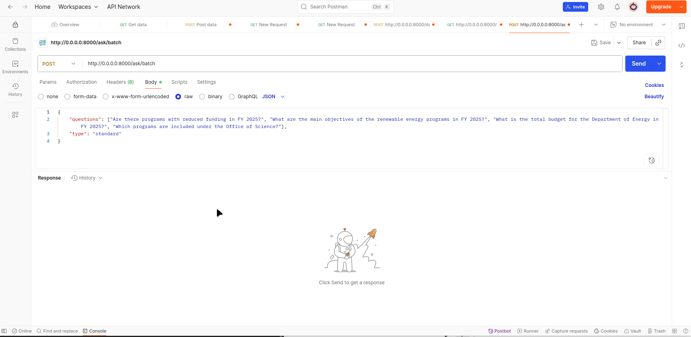

# RAG API Server

A **Retrieval-Augmented Generation (RAG) system** for querying the U.S. Department of Energy FY 2025 budget as a real world example data by using PDF formatted documents. 
Built with **LangChain**, **Chroma**, and **FastAPI**, it allows asking questions and retrieving numerical or contextual answers from documents.


## 📄 Dataset DOE FY 2025 Budget in Brief

This project utilizes the U.S. Department of Energy's **Fiscal Year 2025 Budget in Brief** document as its primary data source. 
The dataset is a publicly available PDF that outlines the DOE's budgetary allocations, priorities, and justifications for the fiscal year 2025.

### 📘 Document Overview

*   **Title:** DOE FY 2025 Budget in Brief
    
*   **Publisher:** U.S. Department of Energy
    
*   **Access:** [https://www.energy.gov/sites/default/files/2024-03/doe-fy-2025-budget-in-brief-v2.pdf](https://www.energy.gov/sites/default/files/2024-03/doe-fy-2025-budget-in-brief-v2.pdf)
    
*   **Format:** PDF
    
*   **Size:** Approximately 100 pages
    
*   **Content:** Detailed breakdown of the DOE's budget, including appropriations by program, office, and state.

### 📊 Key Sections
    
*   The document is structured into several key sections, each providing insights into different aspects of the DOE's budget:
    
*   **Appropriation Summary:** An overview of budget allocations by major program areas.
    
*   **Comparative Organization Summary:** Year-over-year comparisons of funding levels across various offices and programs.
    
*   **State Tables:** Allocations and funding details specific to each U.S. state.
    
*   **Budget Justifications:** Narrative explanations supporting the proposed budget figures.


### 🔍 Usage in the RAG API

The PDF document serves as the foundational dataset for this Retrieval-Augmented Generation (RAG) system. 
The system processes the document to extract relevant information, enabling users to query specific budgetary details through the API. 
For example, users can inquire about the total budget for a particular department or the funding allocated to specific programs within the DOE.
## Features

- Build and store a vector database from PDF documents.
- Ask questions in natural language and get answers with sources and excerpts.
- Support for numerical, standard, and batch queries.
- FastAPI REST API for integration with Postman, front-end, or other services.

### Limitations

*   **Data Format:** The dataset is in PDF format, which may require preprocessing to extract structured data effectively.
    
*   **Coverage:** The system's responses are limited to the information contained within the provided document.
    
*   **Updates:** The dataset corresponds to the FY 2025 budget and does not include information from subsequent fiscal years.

## Project Structure

RAG/

├── dataset/

│ └── usa-2025-budget-brief-energy-dep-v2.pdf

├── chroma/ # Vector database

├── model.py # RAG logic and document processing

├── server.py # FastAPI server

├── requirements.txt # Python dependencies

└── README.md


---

## Installation

1. Clone the repository:

```bash
git clone https://github.com/0quaaD/RAG-API-model.git 
cd RAG-API-model
```

2. Create and activate a Python virtual environment:

```bash
python3 -m venv env
source env/bin/activate  # Linux/macOS
env\Scripts\activate     # Windows
```
3. Install dependencies

```bash
pip install -r requirements.txt
```

4. Add your PDF documents to the dataset/ folder.


Building the Database
---------------------

Before using the API, build the vector database from the PDFs:
```bash
python server.py --build # Or python3 depends on your python
```

This will create the chroma/ folder for storing embeddings.

## Running the API Server
```bash
python server.py --build
# Or
uvicorn server:app --reload
```

Access API docs (Swagger UI) at: [Documentation](http://localhost:8000/docs)

## Usage

### Build the vector database
```http
POST /database/build
```
Response should be like this if built correctly
```json
{
    "success": true,
    "message": "Database built successfully",
    "timestamp": "2025-08-28T18:30:19.700104"
}
```
Ask a single question
```http
POST /ask
```
with this structure
```json
{
    "question": "question goes here",
    "type": "standard ('query' or 'numerical' it's up to you)"
}
```

or ask multiple questions
```http
POST /ask/batch
```
with this structure
```json
{
    "questions": ["your questions list"],
    "type": "numerical ('query' or 'standard')"
}
```
## Usage Examples
1. Asking only one question with this input
```json
{
    "question":  "Which programs are included under the Office of Science?",
    "type": "standard"
}
```
and the output is
```json
{
    "success": true,
    "question": "Which programs are included under the Office of Science?",
    "type": "standard",
    "result": {
        "answer": "The final answer is not a numerical value, but rather a summary of the key points from the provided text.\n\nThe Office of Science (SC) in the Department of Energy (DOE) has several priorities and initiatives:\n\n1. **Basic Research**: SC invests in basic research to advance our understanding of fundamental science and technology gaps.\n2. **Clean Energy**: SC supports research on clean energy, including fusion power, solar energy, wind energy, hydrogen and fuel cell technologies, and advanced materials/manufacturing.\n3. **Climate Modeling**: SC advances climate modeling within the Biological and Environmental Research Program.\n4. **Industrial Decarbonization**: SC accelerates industrial decarbonization through investments in various sectors, including energy use, transportation, and industry.\n5. **Critical Isotope Supply Chains**: SC promotes the domestic establishment of critical isotope supply chains to reduce U.S. dependency on foreign supply.\n\nThe Budget provides an investment of $8.6 billion for SC, advancing toward the authorized level in the CHIPS and Science Act to support cutting-edge research at DOE's 17 National Laboratories and partner universities.\n\nOverall, SC's priorities aim to address the climate crisis by supporting research and development of clean energy technologies, industrial decarbonization, and critical isotope supply chains.",
        "sources": "",
        "excerpts": "--- Source 1 (dataset/usa-2025-budget-brief-energy-dep-v2.pdf) ---\nTotal, Office of Science 8,100,000 8,100,000 8,583,000 +483,000 +5.96% \n      \nAppropriation Overview \nThe Office of Science (SC) is the nation’s largest Federal supporter of basic research in the physical sciences. The SC \nportfolio has two thrusts: direct support of scientific research and direct support of the design, development, construction, \nand operation of unique, open-access scientific u...\n\n--- Source 2 (dataset/usa-2025-budget-brief-energy-dep-v2.pdf) ---\nNuclear Physics 805,196 771,203 833,091 +27,895 +3.46% \nIsotope R&D and Production 109,451 153,551 183,900 +74,449 +68.02% \nAccelerator R&D and Production 27,436 29,175 31,273 +3,837 +13.99% \nWorkforce Development for Teachers and Scientists 42,000 42,100 43,100 +1,100 +2.62% \nScience Laboratories Infrastructure 280,700 293,918 295,180 +14,480 +5.16% \nSafeguards and Security 184,099 200,000 195,00...\n\n--- Source 3 (dataset/usa-2025-budget-brief-energy-dep-v2.pdf) ---\nThis new office will report to the Undersecretary for Science and Innovation, which oversees 13 of the 17 DOE national labs, \nand will be staffed by an interdisciplinary team of experts with the requisite technical and communication skills to \nformulate a coherent vision and strategy to ensure that DOE’s capabilities in critical and emerging technology are leveraged \nacross the Department, the int..."
    },
    "timestamp": "2025-08-28T19:00:25.763048",
    "error": null
}
```
2. Asking multiple questions with this input
```json
{
    "questions":  ["Which programs are included under the Office of Science?", "Are there programs with reduced funding in FY 2025?", "What are the main objectives of the renewable energy programs in FY 2025?", "What is the total budget for the Department of Energy in FY 2025?"],
    "type": "standard"
}
```
and the result is like
```json
{
    "success": true,
    "total_questions": 4,
    "results": [
        {
            "question": "Which programs are included under the Office of Science?",
            "success": true,
            "result": {
                "answer": "The final answer is not a numerical value, but rather an analysis of the provided text.\n\nThe text appears to be a budget justification for the US Department of Energy's Office of Science. The document outlines various programs and initiatives aimed at advancing scientific research, technological innovation, and industrial decarbonization.\n\nSome key takeaways from the text include:\n\n* The Office of Science is requesting $8.6 billion in funding to support cutting-edge research at National Laboratories and partner universities.\n* The budget includes significant investments in basic research for clean energy solutions, climate modeling, and advanced materials/manufacturing.\n* There are also initiatives aimed at accelerating industrial decarbonization, including the Bioenergy Technologies Office, Solar Energy Technologies Office, Wind Energy Technologies Office, Hydrogen and Fuel Cell Technologies Office, and Advanced Materials/Manufacturing and Industrial Efficiency and Decarbonation Offices.\n* The document highlights the importance of addressing the climate crisis through rapid decarbonization across energy use sectors.\n\nOverall, the text suggests that the US Department of Energy's Office of Science is committed to advancing scientific research and technological innovation in support of national priorities, including clean energy and industrial decarbonization.",
                "sources": "",
                "excerpts": "--- Source 1 (dataset/usa-2025-budget-brief-energy-dep-v2.pdf) ---\nTotal, Office of Science 8,100,000 8,100,000 8,583,000 +483,000 +5.96% \n      \nAppropriation Overview \nThe Office of Science (SC) is the nation’s largest Federal supporter of basic research in the physical sciences. The SC \nportfolio has two thrusts: direct support of scientific research and direct support of the design, development, construction, \nand operation of unique, open-access scientific u...\n\n--- Source 2 (dataset/usa-2025-budget-brief-energy-dep-v2.pdf) ---\nNuclear Physics 805,196 771,203 833,091 +27,895 +3.46% \nIsotope R&D and Production 109,451 153,551 183,900 +74,449 +68.02% \nAccelerator R&D and Production 27,436 29,175 31,273 +3,837 +13.99% \nWorkforce Development for Teachers and Scientists 42,000 42,100 43,100 +1,100 +2.62% \nScience Laboratories Infrastructure 280,700 293,918 295,180 +14,480 +5.16% \nSafeguards and Security 184,099 200,000 195,00...\n\n--- Source 3 (dataset/usa-2025-budget-brief-energy-dep-v2.pdf) ---\nThis new office will report to the Undersecretary for Science and Innovation, which oversees 13 of the 17 DOE national labs, \nand will be staffed by an interdisciplinary team of experts with the requisite technical and communication skills to \nformulate a coherent vision and strategy to ensure that DOE’s capabilities in critical and emerging technology are leveraged \nacross the Department, the int..."
            },
            "type": "standard"
        },
        {
            "question": "Are there programs with reduced funding in FY 2025?",
            "success": true,
            "result": {
                "answer": "The final answer is not a numerical value, but rather an explanation of the Department of Energy's (DOE) proposed budget for Fiscal Year 2025.\n\nAccording to the FY 2025 Budget in Brief, the DOE proposes $51 billion in budget authority for FY 2025, a $3.6 billion, or 7.5 percent, increase from the FY 2023 Enacted Level. The budget supports various initiatives, including:\n\n1. Addressing climate change and reducing greenhouse gas emissions\n2. Investing in cutting-edge research at National Laboratories\n3. Advancing critical and emerging technologies\n4. Building the clean innovation pipeline\n5. Reducing health and environmental hazards for at-risk communities\n6. Bolstering the cybersecurity and resilience of the energy sector\n\nThe budget also includes funding for various organizations, including the Federal Energy Regulatory Commission (FERC), with a total of $47.8 billion in funding.\n\nOverall, the FY 2025 Budget supports the DOE's mission to address the Nation's prosperity challenges through transformative science and technological solutions.",
                "sources": "",
                "excerpts": "--- Source 1 (dataset/usa-2025-budget-brief-energy-dep-v2.pdf) ---\nFY 2025 PRE\nSIDENT’S BUDGET FOR DOE \nDOE BUDGET ($BILLIONS) 2023 \nENACTED*^ \n2024 ANNUALIZED CR 2025 REQUEST \nDEFENSE (050) $30.96 $30.96 $33.52 \nNON-DEFENSE (NON-050) $16.86 $17.01 $17.90 \nTOTAL BUDGET AUTHORITY $47.82 $47.97 $51.42 \n* Includes $300 million in emergency designated funding enacted in Division M, Additional Ukraine Supplemental\nAppropriations, of the Consolidated Appropriations Act...\n\n--- Source 2 (dataset/usa-2025-budget-brief-energy-dep-v2.pdf) ---\nFERC will utilize Inflation Reduction Act (IRA) funds in FY 2025 to augment and support its permitting efforts to conduct \neffective and timely environmental reviews and permitting of infrastructure projects. IRA funds will support 44 FTE in FY \n2025 and provide additional training and development for current staff to improve the way the Commission expeditiously \nimplements its statutory responsib...\n\n--- Source 3 (dataset/usa-2025-budget-brief-energy-dep-v2.pdf) ---\nfoundation for future improvements in R&D across the Federal Government. \n \nIn FY 2025, ARPA-E plans to continue funding for Seeding Critical Advances for Leading Energy technologies with Untapped \nPotential (SCALEUP) and release up to 10 new focused Funding Opportunity Announcements (FOAs), including R&D in \nsupport of the Net Zero Gamechangers Initiative five priority areas. The focused FOAs wil..."
            },
            "type": "standard"
        },
        {
            "question": "What are the main objectives of the renewable energy programs in FY 2025?",
            "success": true,
            "result": {
                "answer": "The final answer is not a numerical value, but rather an overview of the Department of Energy's budget for FY 2025.\n\nHere are some key points from the budget:\n\n1. The total appropriation for the Department of Energy is $3.118 billion, which represents a decrease of $342,000 (9.9%) compared to FY 2024.\n2. The Energy Efficiency and Renewable Energy (EERE) program receives $3.118 billion, which includes funding for weatherization assistance programs, state energy programs, community energy programs, and research grants.\n3. The Advanced Research Projects Agency-Energy (ARPA-E) program receives $450 million, which is a decrease of $20 million (4.3%) compared to FY 2024.\n4. The Wind Energy Technologies program prioritizes the development of offshore wind energy technologies, including the Near-term Offshore Wind (NOW) initiative and floating offshore wind projects.\n5. The budget also includes funding for cybersecurity, emergency response, and petroleum reserve accounts.\n\nOverall, the FY 2025 budget for the Department of Energy reflects a focus on energy efficiency, renewable energy, and advanced research projects, while also addressing energy security and grid resilience concerns.",
                "sources": "",
                "excerpts": "--- Source 1 (dataset/usa-2025-budget-brief-energy-dep-v2.pdf) ---\norganizations. \nIE will also continue its efforts to transition Tribal colleges and universities to renewable energy, provide \npower to unelectrified homes, assist Tribes and Tribal entities in accessing to DOE programs and resources, and expand the \nuse of the Indian Energy Purchase Preference. \n  \nBudget in Brief\n52\nFY 2025 Congressional Justification...\n\n--- Source 2 (dataset/usa-2025-budget-brief-energy-dep-v2.pdf) ---\nrelevant technologies, and production of clean hydrogen through gasification. Improvements to these technologies are also \napplicable to other energy systems. These improvements to new and existing plants will also make them less carbon intensive and \nallow these assets to provide continued low-cost baseload power and resilient flexible grid services. This subprogram aligns with the \nAdministratio...\n\n--- Source 3 (dataset/usa-2025-budget-brief-energy-dep-v2.pdf) ---\nassets. \nMicrogrid Generation and Design Deployment is a new program proposed in FY 2025 that focuses on grid resiliency at scale \nby deploying microgrid solutions to communities with high frequency and/or long duration of outages. In FY 2025, the \nprogram will initiate awards to communities to conduct strategic analysis, project design, and generation investment \nactivities for microgrids. \n  \n8 ..."
            },
            "type": "standard"
        },
        {
            "question": "What is the total budget for the Department of Energy in FY 2025?",
            "success": true,
            "result": {
                "answer": "The final answer is not a numerical value, but rather an analysis of the provided text.\n\nHowever, I can extract some key points and statistics from the text:\n\n* The Department of Energy's (DOE) FY 2025 budget request is $33.7 billion.\n* The DOE's National Nuclear Security Administration (NNSA) budget request is $24.9 billion, a 12.8% increase from FY 2024.\n* The NNSA's Weapons Activities budget request is $19.8 billion, a 16.0% increase from FY 2024.\n* The DOE's Energy Programs budget request is $18.1 billion, a 4.1% increase from FY 2024.\n* The DOE's Office of Policy budget request is $149 million, which includes funding for enhanced energy policy and analysis work.\n\nThese statistics provide an overview of the DOE's budget priorities and allocations for FY 2025.",
                "sources": "",
                "excerpts": "--- Source 1 (dataset/usa-2025-budget-brief-energy-dep-v2.pdf) ---\nDOE/CF-0208 \nDepartment of Energy\nFY 2025 \nBudget in Brief \nFY 2025 Congressional Justification \nBudget in Brief\nFY 2025 Congressional Justification...\n\n--- Source 2 (dataset/usa-2025-budget-brief-energy-dep-v2.pdf) ---\nDOE/CF-0208 \nDepartment of Energy\nFY 2025 \nBudget in Brief \nFY 2025 Congressional Justification \nBudget in Brief\nFY 2025 Congressional Justification...\n\n--- Source 3 (dataset/usa-2025-budget-brief-energy-dep-v2.pdf) ---\nBudget in Brief   FY 2025 Congressional Justification \nDEPARTMENT OF ENERGY \nOrganization Summary \nFY 2025 \n(Dollars in Thousands) \n  \nFY 2023 FY 2024 FY 2025 FY 2025 Request vs.  \nFY 2023 Enacted  \n  Enacted(1),(2),(3) Annualized CR Request (4) $ % \nDepartment of Energy Budget by Organization           \nUndersecretary for Nuclear Security and National \nNuclear Security Administration           \nF..."
            },
            "type": "standard"
        }
    ],
    "timestamp": "2025-08-28T19:08:26.251125"
}
```

## Testing on [Postman](https://www.postman.com/)  
1. **/ask** method testing


2. **/ask/batch** method testing



3. **/search** method testing

 
## API Endpoints
| Endpoint           | Method | Description                                                 |
| ------------------ | ------ | ----------------------------------------------------------- |
| `/health`          | GET    | Check server health                                         |
| `/database/status` | GET    | Check database status                                       |
| `/database/build`  | POST   | Build vector database                                       |
| `/ask`             | POST   | Ask a single question (supports `standard` and `numerical`) |
| `/ask/batch`       | POST   | Ask multiple questions (max 10)                             |
| `/search`          | POST   | Search similar documents without LLM                        |
| `/docs`            | GET    | Documentation of API                                        |


### TODO 
1. Create a webpage for the api


---

## License

This project is licensed under the **GNU General Public License v3.0 (GPL-3.0)**.  
See the full license here: [GNU GPL v3](https://www.gnu.org/licenses/gpl-3.0.en.html)

